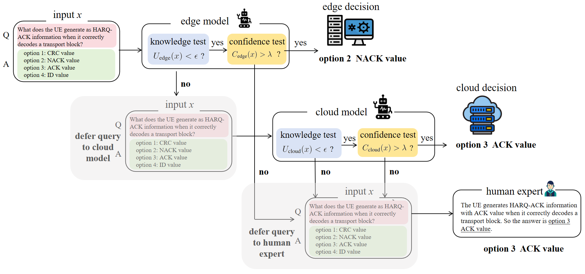

# Reliable LLM-Based Edge-Cloud-Expert Cascades for Telecom Knowledge Systems

This repository contains code for "[Reliable LLM-Based Edge-Cloud-Expert Cascades for Telecom Knowledge Systems](https://arxiv.org/pdf/2512.20012)" -- Qiushuo Hou, Sangwoo Park, Matteo Zecchin, Yunlong Cai, Guanding Yu,Osvaldo Simeone, and Tommaso Melodia

<div align="center">
  
</div>

Figure 1: Cascaded edge-cloud-human system: The query is processed by the edge model $M_{\text{edge}}$ if the edge model's epistemic uncertainty $U_{\text{edge}}(x)$ remains within the acceptable level $\epsilon$, while the confidence $C_{\text{edge}}(x)$ exceeds a threshold $\lambda$, i.e., $U_{\text{edge}}(x) < \epsilon$ and $C_{\text{edge}}(x) > \lambda$. Thus, the edge decision $M_{\text{edge}}(x)$ is produced only if the edge model is sufficiently knowledgeable and confident. When the edge epistemic uncertainty condition is not met, and thus the edge model does not have sufficient knowledge to address the query, the input $x$ is forwarded to the cloud model $M_{\text{cloud}}$. Similar knowledge and confidence tests are carried out for the cloud model based on epistemic uncertainty measure $U_{\text{cloud}}(x)$ and confidence measure $C_{\text{cloud}}(x)$. If the cloud model passes the test, i.e.,  $U_{\text{cloud}}(x) < \epsilon$ and $C_{\text{cloud}}(x) > \lambda$, the cloud decision $M_{\text{cloud}}(x)$ is returned, otherwise, the input $x$ is deferred to a human expert.

## Structure

```
reliable_LLM/
├── conventional_edge_cloud/      # Scenario 1: Conventional deployment
│   ├── hugging_face_model.py     # Model interface (Qwen2-1.5B/7B)
│   ├── evaluation_tool.py        # Evaluation with confidence
│   └── run_experiment.py         # Run experiments
│
├── reasoning_enhanced_cloud/     # Scenario 2: Reasoning-enhanced deployment
│   ├── hugging_face_model.py     # Model interface with thinking budget
│   ├── evaluation_tool.py        # Evaluation for reasoning models
│   └── run_experiment.py         # Run reasoning experiments
│
├── data/                          # Dataset
│   ├── sampled_teleQnA_1k.txt    # Sample TeleQnA dataset for quick start
│   └── TeleQnA.txt               # TeleQnA dataset
│
│── compute_uncertainty_confi.py   # Uncertainty computation  
│ 
├── ltt_fix_sequence_testing.py    # LTT algorithm   
│
├── main.py                        # MHT framework     
│
└── README.md                      # This file
```

## Quick Start

### 1. Conventional Edge-Cloud

```bash
cd conventional_edge_cloud

# Run with logit-based confidence (default)
python run_experiment.py

# To use self-evaluation confidence:
# Edit run_experiment.py, set USE_SELF_CONFIDENCE = True
```

### 2. Reasoning-Enhanced Cloud

```bash
cd reasoning_enhanced_cloud

# Run with thinking budget
python run_experiment.py

# To adjust budget: Edit TOTAL_BUDGET and ANSWER_THINKING_RATIO
```

### 3. MHT Framework

```bash

python main.py --data data/sampled_teleQnA_1k.txt

```

## Key Features

### Model Switching

**Conventional scenario:**
```python
# In run_experiment.py
model_name = "Qwen/Qwen2-1.5B-Instruct"  # Edge
model_name = "Qwen/Qwen2-7B-Instruct"    # Cloud
```

**Reasoning scenario:**
```python
# In run_experiment.py
model_name = "Qwen/Qwen3-4B"  # Reasoning cloud model
```

### Confidence Method Switching

**Conventional scenario:**
```python
# In run_experiment.py
USE_SELF_CONFIDENCE = False  # Logit-based (default)
USE_SELF_CONFIDENCE = True   # Self-evaluation
```

Results automatically saved to different directories based on the mode.


## Requirements

```
torch>=2.0.0
transformers>=4.30.0
numpy>=1.24.0
scipy>=1.10.0
pandas>=2.0.0
rouge>=1.0.1
matplotlib>=3.7.0
networkx>=3.0
```

Install:
```bash
pip install torch transformers numpy scipy pandas rouge matplotlib networkx
```

## Citation

```
@article{hou2026reliable,
  title={Reliable LLM-Based Edge-Cloud-Expert Cascades for Telecom Knowledge Systems},
  author={Hou, Qiushuo and Park, Sangwoo and Zecchin, Matteo and Cai, Yunlong and Yu, Guanding and Simeone, Osvaldo and Melodia, Tommaso},
  journal={arXiv preprint arXiv:2512.20012},
  year={2026},
  url={https://arxiv.org/abs/2512.20012}
}
```

